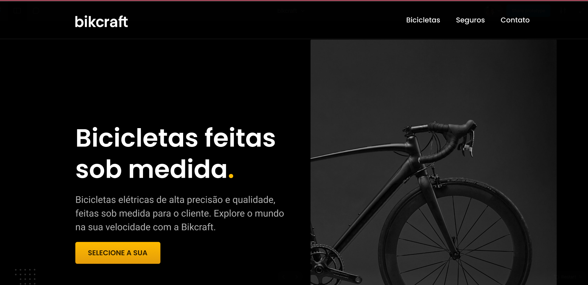

# Bikcraft---Figma
Projeto de um design de site de venda de bicicletas feito no Figma.
# Projeto Figma - Site de venda de Bicicletas

Este é um prototipo de design de um site de bicicletas criado no Figma, o prototipo é clicável e é possivel interagir e clicar nos botões.

## 🔗 Link do projeto no Figma
[Acesse o projeto no Figma](https://www.figma.com/proto/BpiDM9VEcvQ1FJs8GtrHbl/bikcraft?node-id=29-184&p=f&t=eoMXQjXz13l1IPJr-1&scaling=min-zoom&content-scaling=fixed&page-id=0%3A1&starting-point-node-id=29%3A184))

## 📸 Prévia do design

## 📂 Estrutura
- **Imagens:** Contém os arquivos exportados do Figma.

